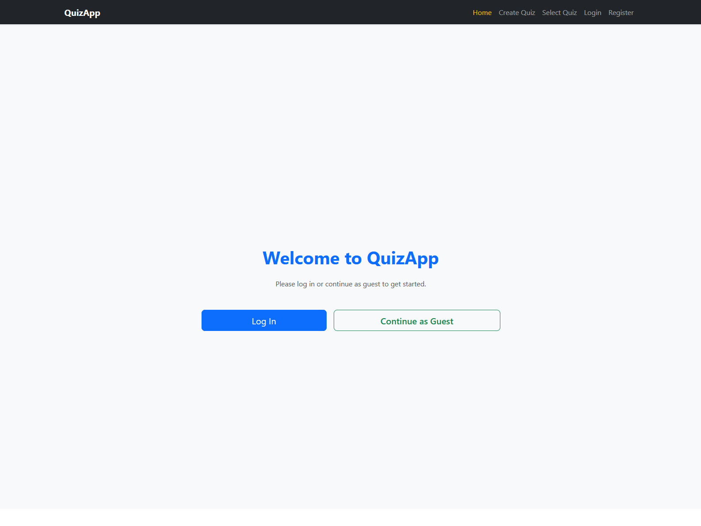
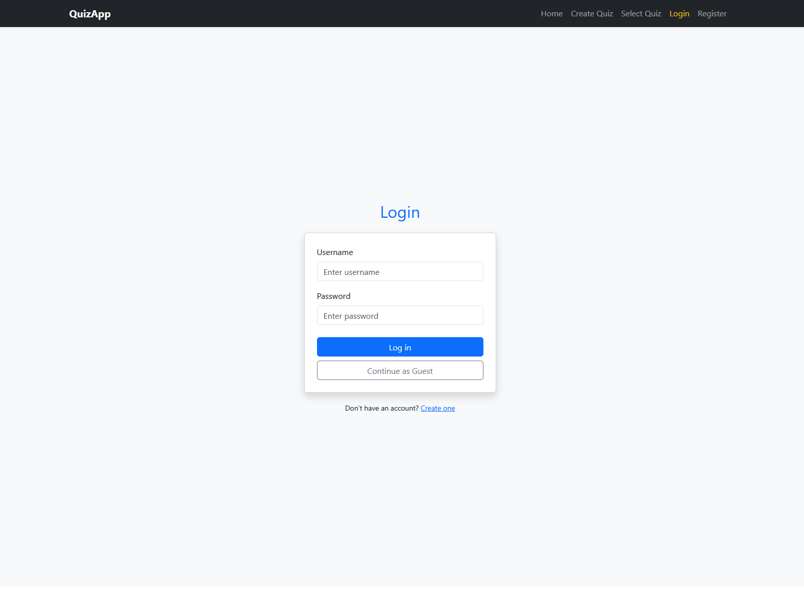
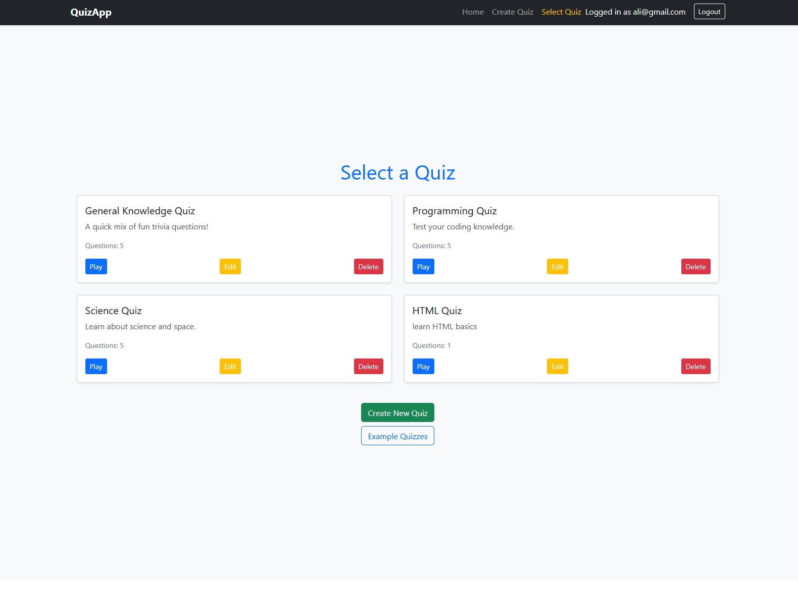
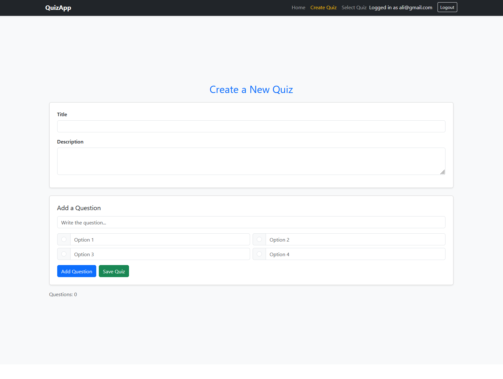
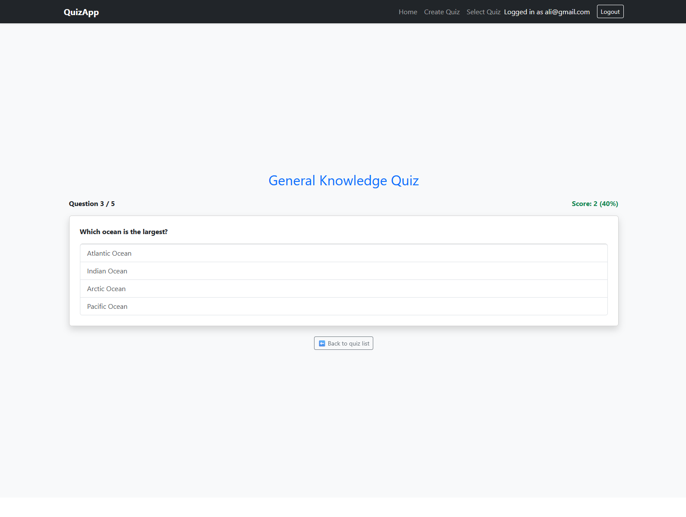
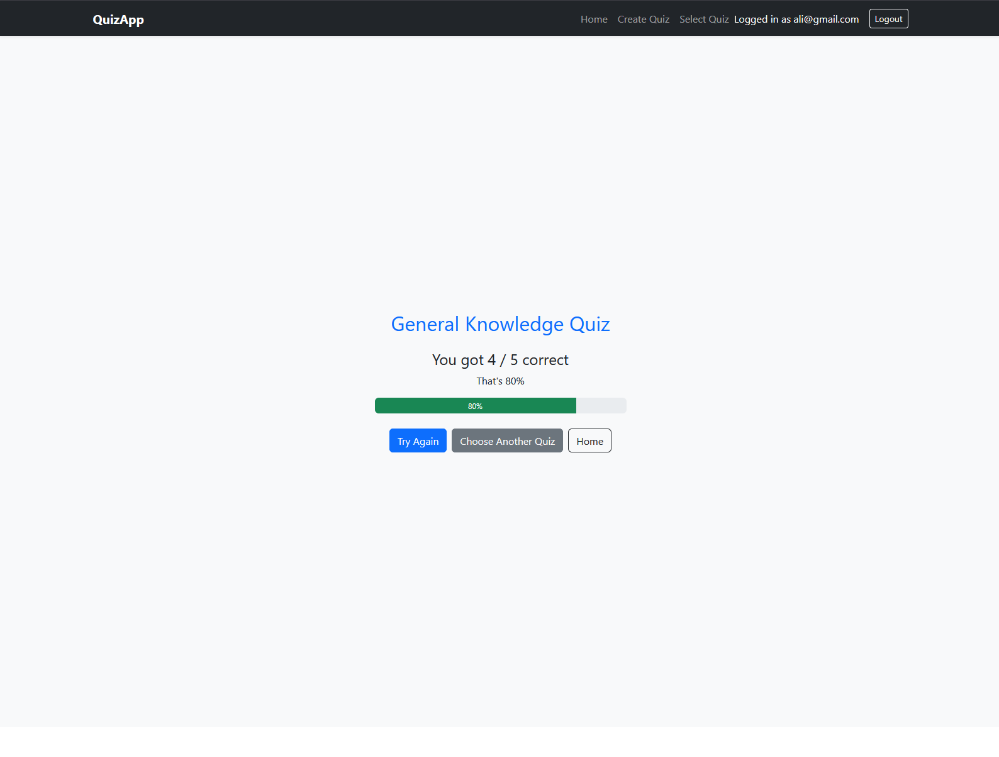

# Full-Stack Quiz App 🎓

A modern full-stack quiz application built with **React**, **ASP.NET Core Web API**, and **Entity Framework Core**.  
Users can create quizzes, play quizzes, edit them, and submit attempts that are stored in the database.

## ✨ Features

### 👥 Authentication
- User registration & login
- JWT-based authentication
- Protected routes for quiz management and gameplay

### 🧠 Quiz Management
- Create new quizzes
- Edit existing quizzes
- Delete quizzes
- Load example quizzes
- Each quiz supports:
  - Title & description
  - Multiple questions
  - Four answer options per question
  - One correct answer

### 🎮 Quiz Gameplay
- Interactive UI
- Highlights correct and incorrect answers
- Prevents re-selecting once answered
- Live score tracking

### 📊 Results & Analytics
- Shows score and percentage
- “Try again” button
- Saves quiz attempts to backend database
- Stores:
  - Score
  - Total questions
  - Percentage
  - User ID
  - Timestamp
  - Quiz ID

---

## 🛠️ Tech Stack

### Frontend
- React 18
- React Router v6
- Bootstrap 5
- Fetch API
- JWT authentication

### Backend
- ASP.NET Core Web API
- Entity Framework Core
- SQL Server / LocalDB
- Repository pattern
- DTO models
- Authentication middleware
  
---

