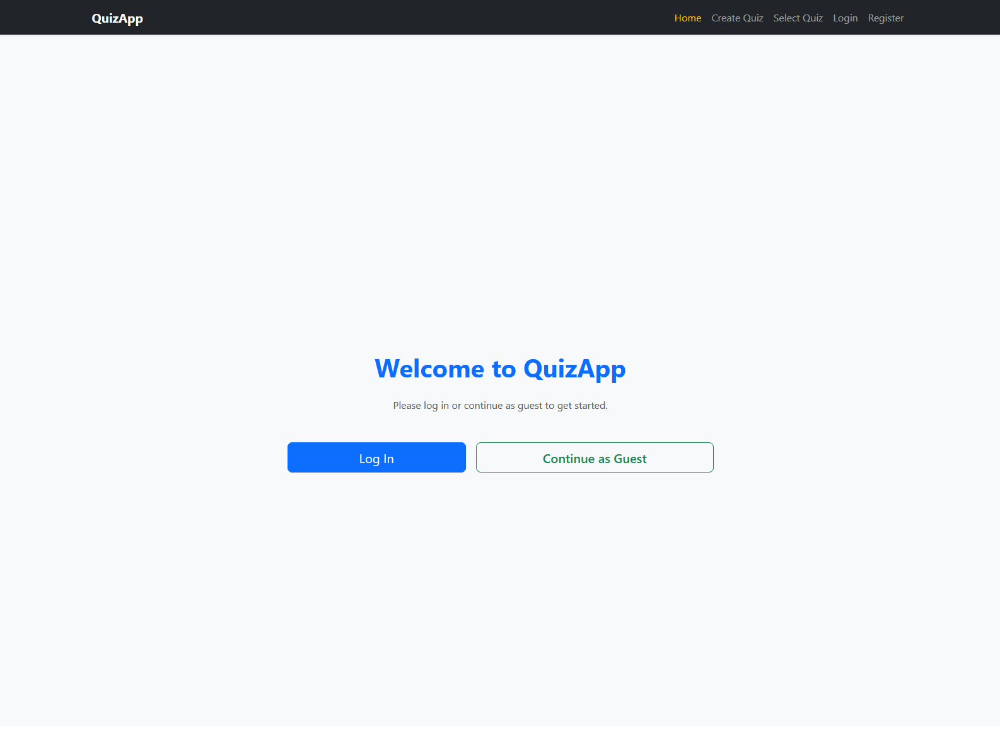
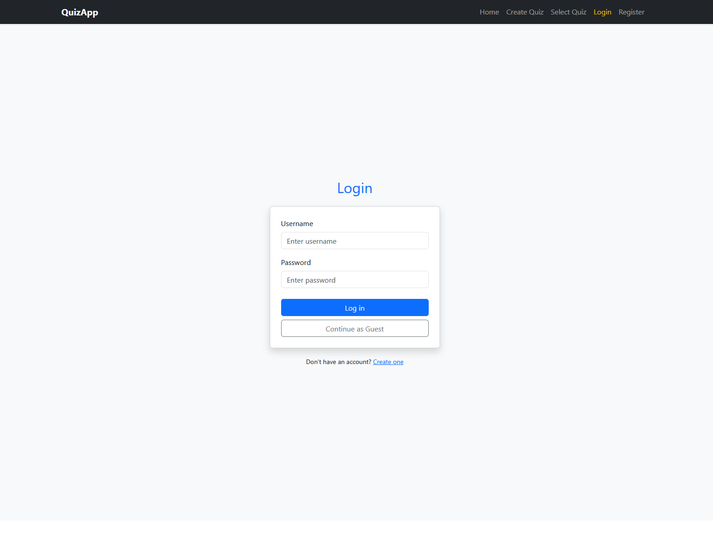
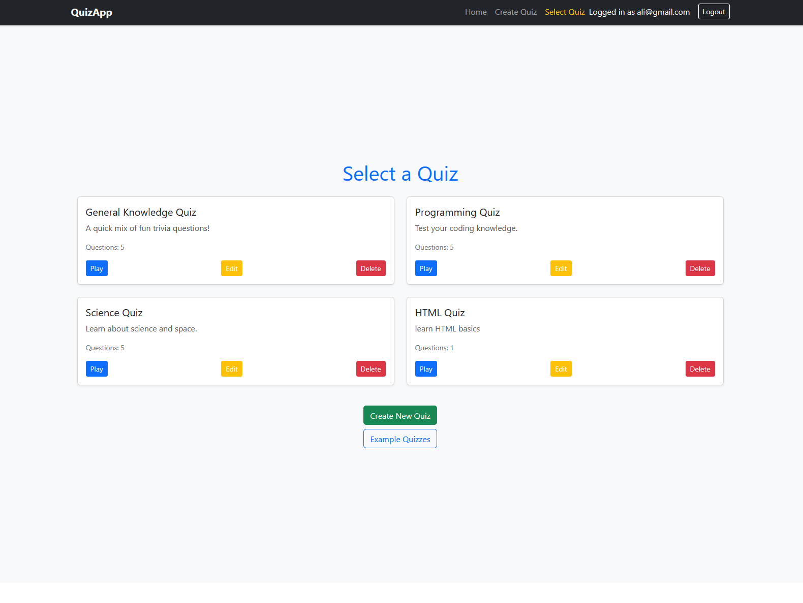
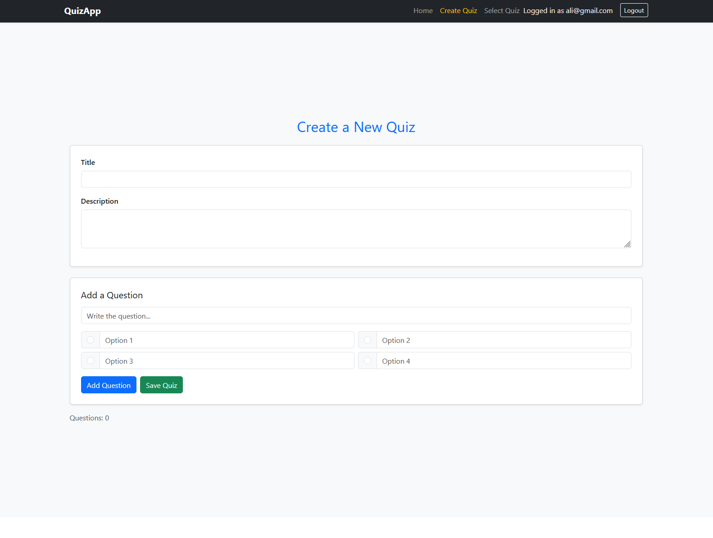
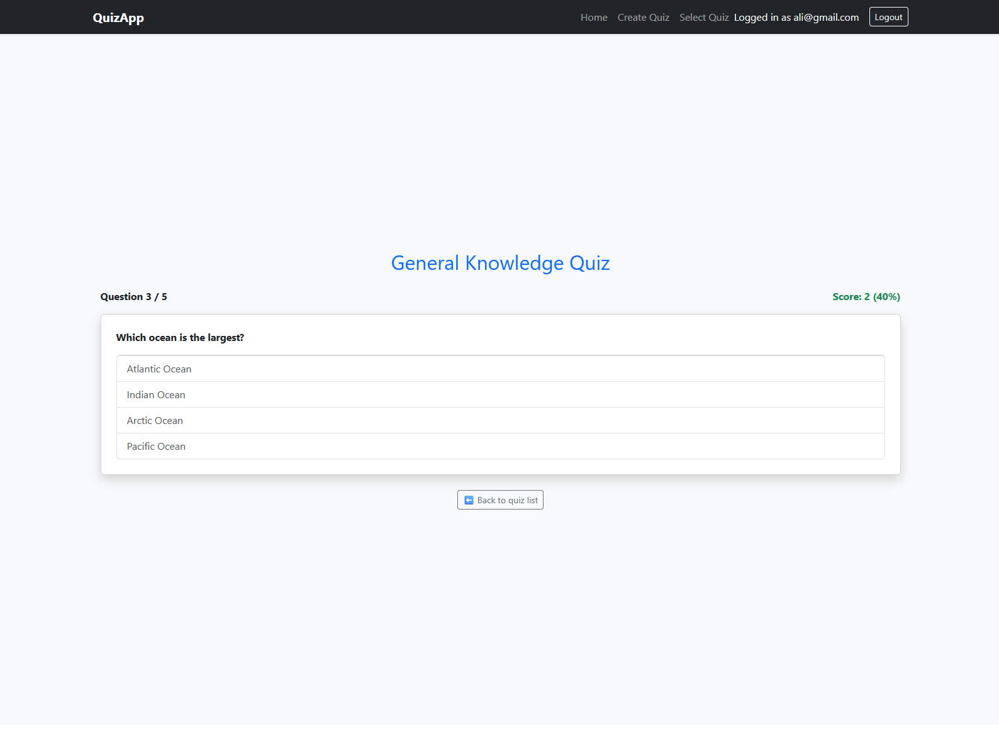
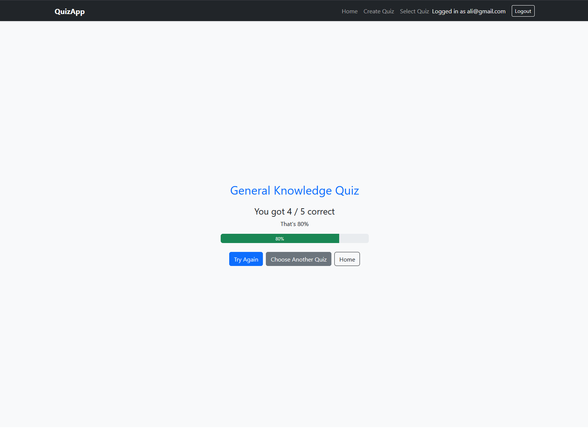

---

# QuizApp – Full-Stack Quiz Application

A full-stack quiz platform built with **ASP.NET Core Web API**, **Entity Framework Core**, **SQL Server**, and a **React** frontend.
Users can register, verify their email, create quizzes, take quizzes, view results, and more. Admins can manage users and quizzes.

---

## 📌 Features

### 👤 Authentication & User Management

* JWT-based authentication
* Register / Login / Forgot Password / Reset Password
* Email verification flag
* Secure password hashing (SHA-256)
* Admin role support

### 📝 Quiz System

* Create quizzes with unlimited questions and answers
* Edit quizzes (only if no attempts exist)
* Take quizzes as an authenticated user or as a guest
* Automatic score calculation
* Record attempts with detailed results
* Delete quiz attempts

### 🔐 Admin Area

* View all users
* Delete users
* View all quizzes

### 🧪 API Testing

* Swagger UI enabled in development
* JWT authentication integrated into Swagger

---

## 🛠️ Backend Setup (ASP.NET Core API)

### **1️⃣ Requirements**

* .NET 8 SDK
* SQL Server / LocalDB
* Visual Studio or VS Code

---

### **2️⃣ Configure the Database**

Update the connection string in `appsettings.json` if needed:

```json
"ConnectionStrings": {
  "DefaultConnection": "Server=(localdb)\\mssqllocaldb;Database=QuizAppApi;Trusted_Connection=True;"
}
```

---

### **3️⃣ Apply Entity Framework Migrations**

From the backend project directory:

```bash
dotnet ef migrations add InitialCreate
dotnet ef database update
```

---

### **4️⃣ Run the Backend**

```bash
dotnet run
```

The API will start on:

```
https://localhost:7000
```

---

## 🎨 Frontend Setup (React)

### **1️⃣ Navigate to the frontend directory**

```bash
cd quiz-client
```

### **2️⃣ Install dependencies**

```bash
npm install
```

### **3️⃣ Start the development server**

```bash
npm start
```

React will run at:

```
http://localhost:3000
```

---

## 🔄 Connecting Frontend & Backend

Ensure that CORS is configured correctly inside `Program.cs`:

```csharp
policy.WithOrigins("http://localhost:3000")
      .AllowAnyHeader()
      .AllowAnyMethod()
      .AllowCredentials();
```

The frontend communicates with the backend using:

```
https://localhost:7000/api/...
```

---

## 🧪 Testing the Application

### ✔️ 1. Register

`POST /api/account/register`
Creates a user with an email verification flag.

### ✔️ 2. Login

Returns:

* JWT token
* Username
* User ID

The frontend stores the token in `localStorage`.

### ✔️ 3. Create a Quiz

Navigate to:

```
/create
```

### ✔️ 4. Edit Quizzes

Navigate to:

```
/select
```

Then choose:

```
/edit/{id}
```

> Editing is disabled once a quiz has recorded attempts.

### ✔️ 5. Play a Quiz

* **Authenticated users:** results are saved
* **Guests:** results are not stored

---

## 📄 License

This project is licensed for educational and portfolio use.

---

## 🙌 Author

QuizApp – React & ASP.NET Core full-stack project.

---

## 📸 Screenshots









---
